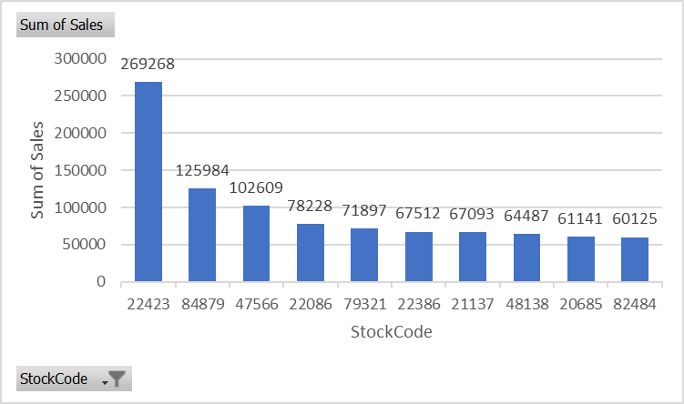
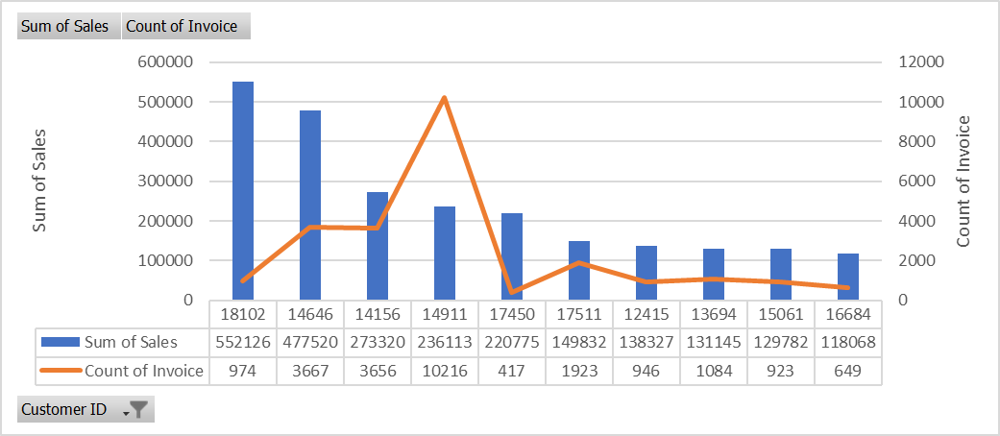
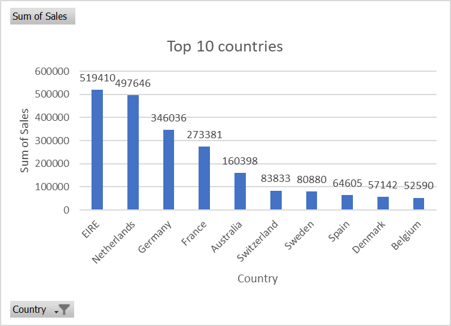
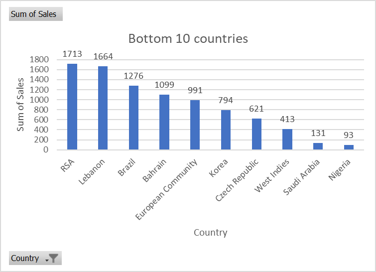
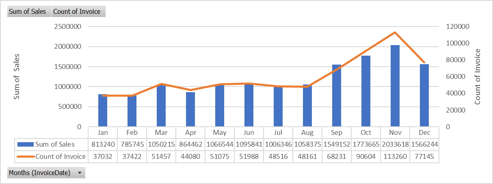

# Mini-Project 1: Analyzing Global E-commerce Trends

Course: Data Fundamentals, Data-Science, Cornerstone  
Instructor: Derrick Park  
Publisher: Yoji Utsumi (TA)  
Last update: Sep 22, 2024

## 1. Clean the data

Dataset: https://archive.ics.uci.edu/dataset/502/online+retail+ii

Before starting to analyze, I have to clean the data. It seems to have a lot of data which don't follow the rules.

For your information, this is variable information
```
- InvoiceNo: Invoice number. Nominal. A 6-digit integral number uniquely assigned to each transaction. If this code starts with the letter 'c', it indicates a cancellation. 
- StockCode: Product (item) code. Nominal. A 5-digit integral number uniquely assigned to each distinct product. 
- Description: Product (item) name. Nominal. 
- Quantity: The quantities of each product (item) per transaction. Numeric.	
- InvoiceDate: Invoice date and time. Numeric. The day and time when a transaction was generated. 
- UnitPrice: Unit price. Numeric. Product price per unit in sterling. 
- CustomerID: Customer number. Nominal. A 5-digit integral number uniquely assigned to each customer. 
- Country: Country name. Nominal. The name of the country where a customer resides.
```

### Erase duplicate rows.

I can delete duplicate rows with Excel function.  
Tool bar > Data > Data tools > Remoce Duplicates

|| Year 2009-2010 | Year 2010-2011 |
| - | - | - |
| Before | 525,462 | 541,911 |
| After | 518,597 | 536,643 |

### Erase rows by StockCode

Acoording to rule, `StockCode` must be 5-digit integral number. Some data have alphabet, I have to delete these kind of data.

I can use Filter function of Excel.  
- Tool bar > Data > Sort & Filter > Filter
- Click StockCode drop down > Sort Largest to smallest
- Excel shows stock code which include alphabet first

|| Year 2009-2010 | Year 2010-2011 |
| - | - | - |
| Before | 518,597 | 536,643 |
| After | 439,266 | 482,155 |

### Erase rows by CustomerID

Some data don't have `CustomerID`.  

I can use Filter function of Excel.  
- Click CustomerID drop down > Unselect All > Go to bottom > Select (Blanks)
- Delete rows(ShortCut: Ctrl & -)

|| Year 2009-2010 | Year 2010-2011 |
| - | - | - |
| Before | 439,266 | 482,155 |
| After | 352,793 | 366,180 |

### Add Sales column

To display Sales, add a `Sales` column which is having formula `[Price] * [Quantity]`

### Integrate sheets

Now I'm having 2 sheets. It is hard to analyze data so I integrate 2 sheets into 1 sheet. After integrating I have 718,972 colums.

## 2. Analyze the Data

### Product Analysis

**Objective**  
Determine the total sales for each product and identify the top 10 selling products.

**Method**  
- Make Pivot table
  - Add `StockCode` in Rows
  - Add `Sum of Sales` in Values
  - (Optional) adjust decimal point
- Filter and Sort
  - Click Row Labels dropdown
    - More sort option: Descending by `Sum of Sales`
    - Values Filters > Top10: Top 10 Items by `Sum of Sales`
- Make PivotChart
  - Go to PivotTable Analyze > Pivot Chart > Clustered Column
  - (Optional) adjust chart elements
  
**Result**  


**Insight**
`22423(REGENCY CAKESTAND 3 TIER)` is standing out. Total Sales 269,268 is more than double score to 2nd saler.

### Customer Analysis

**Objective**  
Calculate the total number of orders per customer and identify the top 10 customers based on total spending.

**Method**  
- Make Pivot table
  - Add `CustomerID` in Rows
  - Add `Sum of Sales` and `Count of Invoice` in Values
  - (Optional) adjust decimal point
- Filter and Sort
  - Click Row Labels dropdown
    - More sort option: Descending by `Sum of Sales`
    - Values Filters > Top10: Top 10 Items by `Sum of Sales`
- Make PivotChart
  - Go to PivotTable Analyze > Pivot Chart > Combo > Clustered Column - Line on Secondary Axis
  - (Optional) adjust chart elements

**Result**  


**Insight**  
CustomerID `18102` and `14646` are standing out because they spent money more than other customers. 18102 is almost double score of 3rd company. On the other hand, CustomerID `14911` has ordered more times than other customers.

### Market Analysis

**Objective**  
Assess the performance of markets outside the UK by comparing sales figures across different countries.

**Method**  
- Make Pivot table
  - Add `Country` in Rows
  - Add `Sum of Sales` in Values
  - Copy Entire table, paste it into another sheet
  - Delete United kingdom row
  - Make Pivot table
    - Add `Country` in Rows
    - Add `Sum of Sales` in Values
    - (Optional) adjust decimal point
- Filter and Sort
  - Click Row Labels dropdown
    - More sort option: Descending by `Sum of Sales`
    - Values Filters > Top10: Top 10 Items by `Sum of Sales`
- Make PivotChart
  - Go to PivotTable Analyze > Pivot Chart > Combo > Clustered Column - Line on Secondary Axis
  - (Optional) adjust chart elements
- Repeat with bottom data
  - Repeat work From `Filter and sort` to `Make PivotChart`. But this time Filters bottom 10.

**Result**  



**Insight**
For your information, before the insight statements, EIRE stands for Ireland, RSA stands for South Africa.  
Top 10 countries are in EU. On the other hand, most of the bottom 10 countries are not in the EU. Only Czech Republic is in EU. Based on these data, the reason of sales trend is obvious. Geography has huge influence on sales.

### Seasonal Trend Analysis

**Objective**  
Examine how sales figures vary month-to-month to identify any seasonal trends that the business could capitalize on.

**Method**  
- Make Pivot table
  - Add `Months(InvoiceDate)` in Rows
  - Add `Sum of Quantity` and `Sum of Sales` in Values
  - (Optional) adjust decimal point
- Make PivotChart
  - Go to PivotTable Analyze > Pivot Chart > Combo > Clustered Column - Line on Secondary Axis
  - (Optional) adjust chart elements

**Result**  


**Insight**
From Jan to Aug, `Sum of Sales` and `Count of Invoice` are fairly flat. But from Sep to Dec, both increase rapidly.

## Interpret and Report

### Data Summary

**Top-selling products**  
Acoording to [Analyze the Data - Product Analysis](#product-analysis), these products are top-10-selling products.

| StockCode | Description	| Sum of Sales |
| - | - | - |
| 22423 | REGENCY CAKESTAND 3 TIER | 269268 |
| 84879 | ASSORTED COLOUR BIRD ORNAMENT | 125984 |
| 47566 | PARTY BUNTING | 102609 |
| 22086 | PAPER CHAIN KIT 50'S CHRISTMAS  | 78228 |
| 79321 | CHILLI LIGHTS | 71897 |
| 22386 | JUMBO BAG PINK WITH WHITE SPOTS | 67512 |
| 21137 | BLACK RECORD COVER FRAME | 67093 |
| 48138 | DOORMAT UNION FLAG | 64487 |
| 20685 | DOORMAT RED RETROSPOT | 61141 |
| 82484 | WOOD BLACK BOARD ANT WHITE FINISH | 60125 |

**Customer loyalty**    
This data is top 10 loyal `CustomerID` with `Country`. In this case, I rank customers depending on how many times they have issued `Invoices`.

| CustomerID | Country | Count of Invoice |
| - | - | - |
| 17841 | United Kingdom | 11061 |
| 14911 | EIRE | 10216 |
| 12748 | United Kingdom | 6141 |
| 14606 | United Kingdom | 5692 |
| 14096 | United Kingdom | 4558 |
| 15311 | United Kingdom | 3800 |
| 14646 | Netherlands | 3667 |
| 14156 | EIRE | 3656 |
| 13089 | United Kingdom | 3157 |
| 16549 | United Kingdom | 2855 |

**International market performance**  
[Analyze the Data - Market Analysis](#market-analysis) can be enough information in order to discuss.

### Discussing porential reasons

#### My expectation

First of all, this dataset is UK-based gift-ware retail transactions. I expected that most of the customers were also from the UK and there are no customers from outside Europe because people from outside Europe (such as Asians, Latin Americans, and Westerners) don't prefer British things as gifts.

#### Analysis and Results

My expectation is correct! Top 10 selling products seem to be influenced by British cultur Especially top-1-product `22423(REGENCY CAKESTAND 3 TIER)` which is for Afternoon Tea. Afternoon Tea is a one of the biggest British culture and also, most of the loyal customers are from the UK. As I mentioned on [Seasonal Trend](#seasonal-trend-analysis), sales tend to be high from Sep to Dec. Reason is obvious. It is because of the Christmas. People buy gift as a Christmas gift.

### Any modifications

There is a huge sales gap between UK and other countries. I recommend to try to increase sales from outside UK. Even though the UK has already left the EU, there is no customs duty between the UK and EU countries. It can be a great advantage for the UK company.  
As I mentioned few times, CAKESTAND is top seller. but it has only 3 variety.

 - 22776: CAKESTAND, 3 TIER, LOVEHEART
 - 22435: REGENCY CAKESTAND 3 TIER
 - 22776: SWEETHEART CAKESTAND 3 TIER

I recommend to make a new version of CAKESTAND(eg. new color).